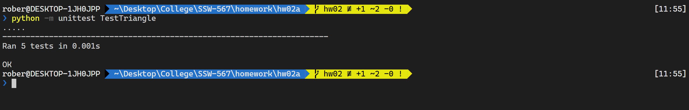

# HW 02a Report

**Description:**

Sometimes you will be given a program that someone else has written, and you will be asked to fix, update and enhance that program. In this assignment you will start with an existing implementation of the classify triangle program that will be given to you. You will also be given a starter test program that tests the classify triangle program, but those tests are not complete.  

These are the two files: `Triangle.py` and `TestTriangle.py`.

`Triangle.py` is a starter implementation of the triangle classification program.  

`TestTriangle.py`  contains a starter set of unittest test cases to test the `classifyTriangle()` function in the file `Triangle.py` file.  

In order to determine if the program is correctly implemented, you will need to update the set of test cases in the test program. You will need to update the test program until you feel that your tests adequately test all of the conditions. Then you should run the complete set of tests against the original triangle program to see how correct the triangle program is. Capture and then report on those results in a formal test report described below. For this first part you should not make any changes to the classify triangle program. You should only change the test program.

Based on the results of your initial tests, you will then update the classify triangle program to fix all defects.  Continue to run the test cases as you fix defects until all of the defects have been fixed. Run one final execution of the test program and capture and then report on those results in a formal test report described below.   

> Note that you should NOT simply replace the logic with your logic from Assignment 1. Test teams typically don't have the luxury of rewriting code from scratch and instead must fix what's delivered to the test team.   

`Triangle.py` contains an implementation of the `classifyTriangle()` function with a few bugs.  

 `TestTriangle.py` contains the initial set of test cases

## Results 

**Summary**

In order to determine whether all cases were covered, a strategy to generate all possible permuations of sets of 3 numbers was created. By testing all permutations of a, b, and c for a given type of triangle, it can be determined that each type of triangle is sufficiantly tested. 

|                | Test Run 1                                                                                                                                                                                                                                                                                                                                                          | Test Run 2 |
|----------------|---------------------------------------------------------------------------------------------------------------------------------------------------------------------------------------------------------------------------------------------------------------------------------------------------------------------------------------------------------------------|------------|
| Tests Planned  | testRightTriangle() testScaleneTriangle() testIsosceleseTriangle() testEquilateralTriangle() testNotATriangle()                                                                                                                                                                                                                                                     |            |
| Tests Executed | ALL                                                                                                                                                                                                                                                                                                                                                                 | ALL        |
| Tests Passed   | NONE                                                                                                                                                                                                                                                                                                                                                                | ALL        |
| Defects Found  | <ul> <li>error in input check 'b <= b' will always be true</li> <li>error in checking if the sum of two sides is strictly less than the third side</li> <li>equilateral triangle does not test if a == c</li> <li>right triangle does not test for all possible cases</li> <li>scalene triangle checks (a != b) twice</li> </ul>                                    | NONE       |
| Defects Fixed  | <ul> <li>change input check 'b <= b' to 'b <= 0'</li> <li>fix valid triangle check such that the **sum** of every possible pairing is strictly less than the third side</li> <li>add a == c to equilateral triangle case</li> <li>add missing right triangle test cases</li> <li>change the second instance of (a != b) to (a != c) for scalene triangle</li> </ul> | NONE       |

### Buggy Test Results
| Test ID                 | Input                       | Expected Results | Actual Result | Pass/Fail |
|-------------------------|-----------------------------|------------------|---------------|-----------|
| testRightTriangle       | permutations of [3, 4, 5]   | Right            | InvalidInput  | Fail      |
| testScaleneTriangle     | permutations of [2, 3, 4]   | Scalene          | InvalidInput  | Fail      |
| testIscoscelesTriangle  | permutations of [2, 2, 3]   | Isosceles        | InvalidInput  | Fail      |
| testEquilateralTriangle | permutations of [1, 1, 1]   | Equilateral      | InvalidInput  | Fail      |
| testNotATriangle        | permutations of [1, 1, 100] | NotATriangle     | InvalidInput  | Fail      |

### Fixed Test Results
| Test ID                 | Input                       | Expected Results | Actual Result | Pass/Fail |
|-------------------------|-----------------------------|------------------|---------------|-----------|
| testRightTriangle       | permutations of [3, 4, 5]   | Right            | Right         | Pass      |
| testScaleneTriangle     | permutations of [2, 3, 4]   | Scalene          | Scalene       | Pass      |
| testIscoscelesTriangle  | permutations of [2, 2, 3]   | Isosceles        | Isosceles     | Pass      |
| testEquilateralTriangle | permutations of [1, 1, 1]   | Equilateral      | Equilateral   | Pass      |
| testNotATriangle        | permutations of [1, 1, 100] | NotATriangle     | NotATriangle  | Pass      |

## Successful Output

> 

